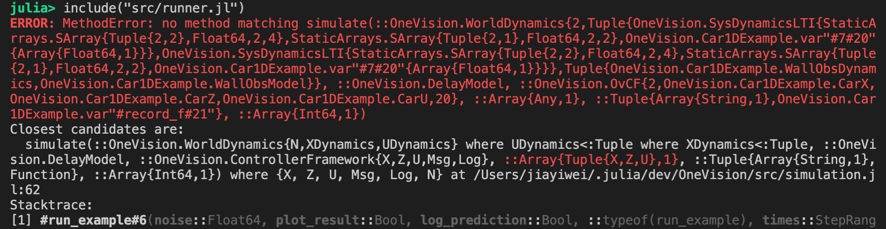
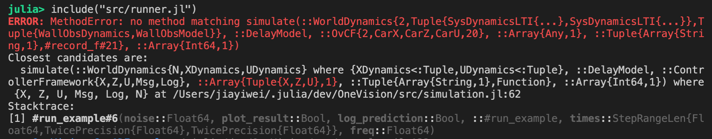

# SimpleTypePrint.jl

[](https://travis-ci.com/MrVPlusOne/SimpleTypePrint)
[](https://codecov.io/gh/MrVPlusOne/SimpleTypePrint)

**Display Julia types in a more human-friendly way.**

## Motivation

This package provides alternative type printing functions to make it easier to read Julia types. So instead of having to read messy outputs like this:


Using this package, we can overwrite `Base.show(::IO, ::Type)` to achieve a much cleaner result:


## Usages
First, install the package with
```julia
Using Pkg; Pkg.add("SimpleTypePrint")
```

You can then override the default type printing behavior by calling
```julia
config_type_display(max_depth=3, short_type_name=true)
```

If you prefer not to override the Julia default, you can instead use the provided `show_type(io, type; kwargs...)` and `repr_type(type; kwargs...)` function to manually print selected types.

## Changes compared to `Base.show`

 - Merging nested where clauses
 ```julia
julia> using SimpleTypePrint: repr_type

julia> repr(Tuple{A,B,C} where {A, B, C})
"Tuple{A,B,C} where C where B where A"  # By default, Julia display multiple where clauses separately

julia> repr_type(Tuple{A,B,C} where {A, B, C})
"Tuple{A,B,C} where {A,B,C}"  # Where clauses are correctly merged, just like how you would write them
 ```

 - Displaying deep parts as ellipsis
 ```julia
julia> repr_type(Tuple{Tuple{Tuple{A,B},C},D} where {A,B,C,D})
"Tuple{Tuple{Tuple{...},C},D} where {A,B,C,D}"  # By default, the maximal display depth is 3

julia> repr_type(Tuple{Tuple{Tuple{A,B},C},D} where {A,B,C,D}; max_depth=5)
"Tuple{Tuple{Tuple{A,B},C},D} where {A,B,C,D}"  # You can always increase `max_depth` as needed
 
 julia> repr_type(Tuple{A} where {A <: Tuple{Tuple{Tuple{Int}}}})
"Tuple{A} where A<:Tuple{Tuple{...}}"  # depth limit also applies to type constraints
 ```

- Displaying type names without module prefixes
```julia
julia> module A
           module B
               struct Foo{A} end
           end
       end  # Foo is nested inside A and B.
Main.A

julia> repr(A.B.Foo)
"Main.A.B.Foo"  # By default, Julia displays with module prefixes unless the type is directly visible from the current scope

julia> repr_type(A.B.Foo; short_type_name=true)
"Foo{A} where A"
```

- Renaming type variables with conflicting names
```julia
julia> repr(Tuple{(Tuple{A} where A), A} where A)
"Tuple{Tuple{A} where A,A} where A"

julia> repr_type(Tuple{(Tuple{A} where A), A} where A)
"Tuple{Tuple{A1} where A1,A} where A"
```

